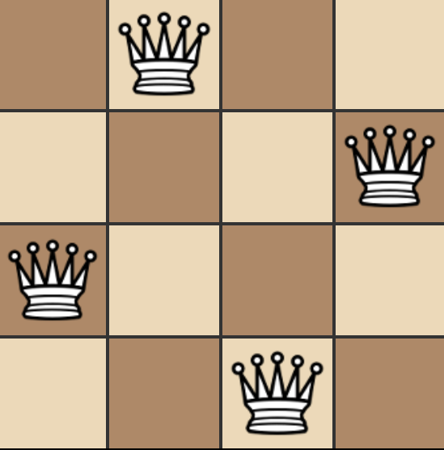

<!-- PROJECT LOGO -->
<br />
<p align="center">
  <a href="https://github.com/othneildrew/Best-README-Template">
    
  </a>

  <h3 align="center">N Queens Solver</h3>

  <p align="center">
    A genetic algorithm for solving the N Queens Problem
    <br />
    <br />
    <a href="https://diezaztek.github.io/n-queens-genetic-algorithm/">View Demo</a>
    ·
    <a href="https://github.com/Diezaztek/n-queens-genetic-algorithm/issues">Report Bug</a>
    ·
    <a href="https://github.com/Diezaztek/n-queens-genetic-algorithm/issues">Request Feature</a>
  </p>
</p>


<!-- TABLE OF CONTENTS -->
<details open="open">
  <summary>Table of Contents</summary>
  <ol>
    <li>
      <a href="#about-the-project">About The Project</a>
      <ul>
        <li><a href="#problem-description">Problem Description</a></li>
        <li><a href="#algorithm-intuition">Algorithm intuition</a></li>
        <li><a href="#built-with">Built With</a></li>
      </ul>
    </li>
    <li>
      <a href="#getting-started">Getting Started</a>
      <ul>
        <li><a href="#prerequisites">Prerequisites</a></li>
        <li><a href="#installation">Installation</a></li>
      </ul>
    </li>
    <li><a href="#usage">Usage</a></li>
    <li><a href="#roadmap">Roadmap</a></li>
    <li><a href="#contributing">Contributing</a></li>
    <li><a href="#license">License</a></li>
    <li><a href="#contact">Contact</a></li>
    <li><a href="#acknowledgements">Acknowledgements</a></li>
  </ol>
</details>


<!-- ABOUT THE PROJECT -->
## About The Project

### Problem Description

The N Queen is the problem of placing N chess queens on an N×N chessboard so that no two queens attack each other. For example an 4 queen problem solution would look something like this:

<p align="center">
  
</p>

The problem itself has the constrain that the minimum amount of queens that can be placed is 4

### Algorithm Intuition

For solving this problem, a genetic algorithm approach was chosen. The abstraction made was the following:
* **Individual:** NxN board with N queens placed
* **Population:** Set of M boards
* **Phenotype:** The representation of the board and the queens placed
* **Genotype:** A one dimensional array  with a length of N. In which each position represents the row number, and the content the column number.

For example, the Genotype [1, 3, 0 , 2] represents the following phenotype

<p align="center">
  
</p>

>The array is 0-index based

The abstraction in code of the board can be found in the [scripts/classes.js](https://github.com/Diezaztek/n-queens-genetic-algorithm/blob/main/scripts/classes.js) file as the Board class

After the problem abstraction a pseudo algorithm was made for solving the problem as follows

```
1. Declare an initial M population size
2. Declare queens to be placed N
3. Create M boards with N random queens placed
with the constraint that only one queen per row
and column
4. while true
  5. Order the population based on the quantity of
  queens that attack each other, the less the better
  6. if the first element punctuation == 0
    7. break the cycle and return the solution
  8. Get the first 10% of the population and pass it to the next generation
  9. The first 50% of population will be the parents of the new boards
  10. Select two random parents of the valid ones and merge them to create
  a new board (random genes from the parent A will be passed to the child
  and the remaining ones will be taken form the parent B)
  11. With the probability of 10% the new board will mutate (exchange two genes from order)
  12. The population is now set to the new generation
```

This implementation can be found in [scripts/index.js](https://github.com/Diezaztek/n-queens-genetic-algorithm/blob/main/scripts/index.js) in the calculateResult method

### Built With

This application was build using the following libraries/frameworks

* [Bootstrap](https://getbootstrap.com)
* [JQuery](https://jquery.com)


<!-- GETTING STARTED -->
## Getting Started

To get a local copy up and running follow these simple example steps.

### Prerequisites

You need a webserver to run the application. If you have python installed in your system you can just use the [http.server module](https://docs.python.org/3/library/http.server.html#module-http.server)

```sh
python -m http.server 8000
```

### Installation

1. Clone the repository
```sh
git clone https://github.com/Diezaztek/n-queens-genetic-algorithm.git
```
2. Change to the project folder
```sh
cd n-queens-genetic-algorithm
```
3. Run your webserver (for example)
```sh
python -m http.server 8000
```
4. Enter in your browser to the URL http://localhost:8000


<!-- USAGE EXAMPLES -->
## Usage

For using the application you just need to enter a valid N value in the input field, then just press calculate

![App screenshot][app-screenshot]

Theorically the max amount of queens you can calculate depends no the process power of your CPU, it has a limit of 75 as it was the maximum number of queens that could be placed in a few minutes


<!-- ROADMAP -->
## Roadmap

See the [open issues](https://github.com/othneildrew/Best-README-Template/issues) for a list of proposed features (and known issues).


<!-- CONTRIBUTING -->
## Contributing

Contributions are what make the open source community such an amazing place to be learn, inspire, and create. Any contributions you make are **greatly appreciated**.

1. Fork the Project
2. Create your Feature Branch (`git checkout -b feature/AmazingFeature`)
3. Commit your Changes (`git commit -m 'Add some AmazingFeature'`)
4. Push to the Branch (`git push origin feature/AmazingFeature`)
5. Open a Pull Request


<!-- LICENSE -->
## License

Distributed under the MIT License. See `LICENSE` for more information.


<!-- CONTACT -->
## Contact

Francisco Torres - [LinkedIn](https://www.linkedin.com/in/francisco-torres-castillo-386a3a187/)

Project Link: [https://github.com/Diezaztek/n-queens-genetic-algorithm](https://github.com/Diezaztek/n-queens-genetic-algorithm)


<!-- ACKNOWLEDGEMENTS -->
## Acknowledgements
* [Best-README-Template](https://github.com/othneildrew/Best-README-Template)
* [Choose an Open Source License](https://choosealicense.com)
* [GitHub Pages](https://pages.github.com)
* [Free Frontend](https://freefrontend.com/css-spinners/)
* [Font Awesome](https://fontawesome.com)


<!-- MARKDOWN LINKS & IMAGES -->
[4-4-board-solution-screenshot]: images/4-4-board.png
[app-screenshot]: images/app_screenshot.png
